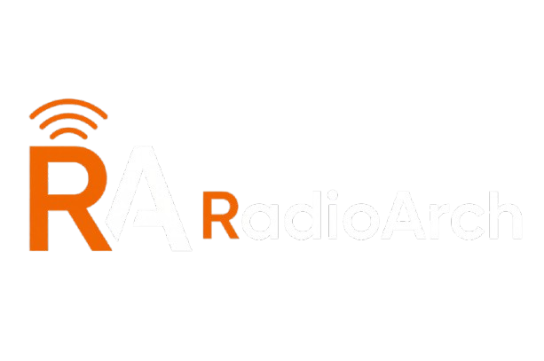

  

<h1 align="center">📻 RadioArch</h1>

  <em>A Frequência Perfeita. Um web player de rádio retro-futurista inspirado em interfaces de terminal e no ecossistema Arch Linux.</em>

  
  
  
  
  

<h3 align="center">
  🔴 <a href="https://SEU-LINK-AQUI.vercel.app" target="_blank">Acessar o RadioArch Online</a>
</h3>

## 🎯 A Proposta
O **RadioArch** nasceu da vontade de unir a nostalgia dos rádios analógicos e ecrãs LCD antigos com a velocidade e o design das tecnologias web modernas. A proposta é oferecer uma experiência imersiva e altamente personalizável para escutar rádios do mundo inteiro, com um visual clean e comandos de teclado integrados, otimizado tanto para Desktop (simulando um hardware real) como para Mobile.

## 💡 Sobre o Projeto
Desenvolvido por **Luis Paulo (@LuisPauloCN507)**, este projeto serve como um laboratório prático para aplicar conceitos avançados de Front-End, incluindo manipulação de áudio com a Web Audio API, animações complexas baseadas em *scroll* (Intersection Observer), design responsivo extremo (Tailwind CSS) e consumo de APIs externas (Radio Browser API).

## ✨ Funcionalidades Principais

* **Player Analógico & Visualizador de Áudio:** Painel LCD interativo com barras de equalização em tempo real (Web Audio API).
* **Temas Customizáveis:** Alterna a cor do ecrã LCD entre `CYAN`, `PAPAYA`, `ARCH` e `TERMINAL`.
* **Global Scanner API:** Pesquisa e adiciona rádios de qualquer país ou género através da base de dados global do *Radio-Browser*.
* **Injeção de Frequência:** Adiciona a tua própria URL de streaming (Web Radio customizada) diretamente no deck.
* **Gravador Integrado (REC):** Grava os teus excertos de rádio favoritos diretamente para o teu PC em formato `.webm`.
* **Command Center:** Controlo total por atalhos de teclado (ex: `Espaço` para Play, `M` para Mute, `C` para mudar de cor, `K` para abrir o menu).
* **Sleep Timer:** Programa o rádio para desligar automaticamente (15, 30 ou 60 minutos).
* **System Dump (Backup/Restore):** Exporta e importa as tuas rádios customizadas, favoritos e configurações num ficheiro `.json`.

## 🛠️ Tecnologias Utilizadas

* **Framework:** [Next.js](https://nextjs.org/) (App Router)
* **Estilização:** [Tailwind CSS](https://tailwindcss.com/)
* **Ícones:** [Lucide React](https://lucide.dev/)
* **API de Rádios:** [Radio Browser API](https://www.radio-browser.info/)
* **Áudio:** HTML5 `<audio>` + Web Audio API + MediaRecorder
* **Hospedagem:** [Vercel](https://vercel.com/)
